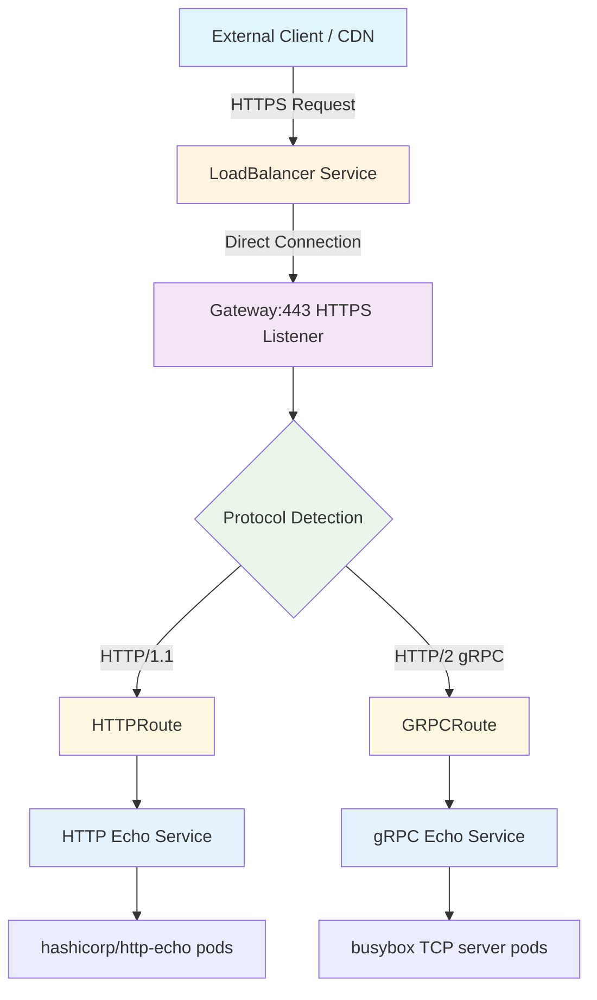
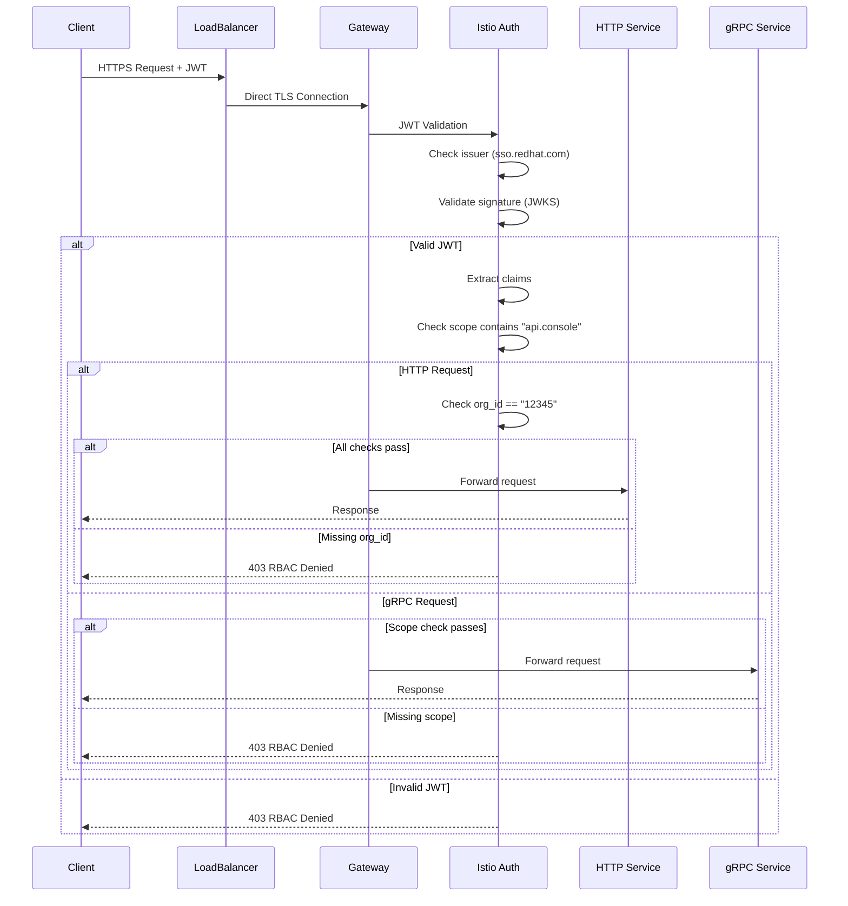
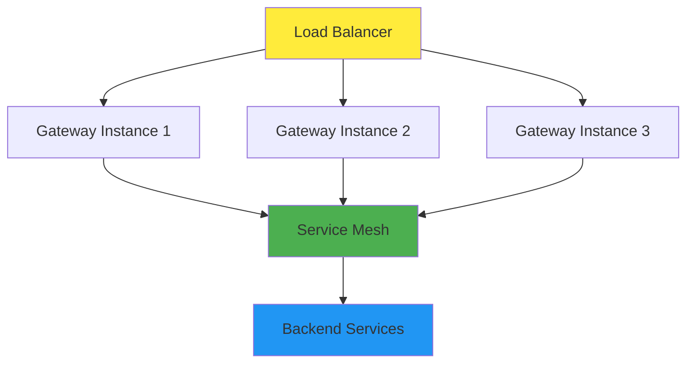

# OpenShift Service Mesh 3 Gateway API - Architecture

This document provides a comprehensive architectural overview of the OpenShift Service Mesh 3 Gateway API implementation with JWT authentication, including traffic flow diagrams, security patterns, and key design decisions.

## 🏗️ Traffic Flow Architecture

The following diagram shows how external requests flow directly to the Gateway API via LoadBalancer, ideal for CDN and custom domain setups:



### Traffic Flow Explanation

1. **External Client or CDN** makes HTTPS requests directly to LoadBalancer endpoint
2. **LoadBalancer Service** forwards traffic directly to Gateway pods
3. **Gateway** (port 443) terminates TLS and handles protocol detection
4. **Protocol Detection** routes traffic based on HTTP version:
   - HTTP/1.1 requests → HTTPRoute
   - HTTP/2 gRPC requests → GRPCRoute
5. **Routes** direct traffic to appropriate backend services
6. **Services** forward requests to the actual application pods

## 🔐 Authentication & Authorization Flow

This sequence diagram illustrates the complete JWT authentication and claims-based authorization process:



### Authentication & Authorization Steps

1. **JWT Extraction**: Token extracted from Authorization header or query parameters
2. **Issuer Validation**: Verify token issuer matches `sso.redhat.com`
3. **Signature Validation**: Validate JWT signature using JWKS endpoint
4. **Claims Extraction**: Extract claims from validated JWT payload
5. **Global Authorization**: Check if scope contains `"api.console"`
6. **Service-Specific Authorization**: Additional checks based on target service
   - HTTP services: Require `org_id == "12345"`
   - gRPC services: Global scope check sufficient
7. **Traffic Forwarding**: Route authenticated/authorized requests to backend services

## 🏛️ Key Architectural Patterns

### OpenShift Gateway API Integration

**GatewayClass Pattern**:
- Uses `openshift-default` GatewayClass
- Creates LoadBalancer services automatically
- Integrates with OpenShift's native networking

**Direct LoadBalancer Access**:
- External clients connect directly to LoadBalancer endpoint
- No OpenShift Route required (simpler architecture)
- Perfect for CDN integration (Akamai, CloudFlare, etc.)
- Custom domain CNAMEs point directly to LoadBalancer

**Protocol Handling**:
- Single Gateway listener handles multiple protocols via detection
- HTTP/1.1 and HTTP/2 automatically differentiated
- No hostname restrictions allow flexible domain configuration
- Routes attach to listeners by `sectionName` reference

### Security Architecture

**Authentication Layer**:
- `RequestAuthentication` extracts and validates JWTs
- Configurable for multiple token issuers
- Flexible token source configuration (headers, query params)

**Authorization Layer**:
- Layered `AuthorizationPolicy` for granular access control
- Global Gateway policies for common requirements
- Service-specific policies for additional constraints

**Claims Validation**:
- Flexible rule engine for custom claim requirements
- Support for multiple claim types and validation patterns
- Extensible for additional authorization logic

**Default Deny Model**:
- Explicit DENY policy ensures security-first approach
- All traffic denied unless explicitly allowed
- Clear audit trail for access decisions

## 🚀 Production Architecture Considerations

### High Availability



**Recommendations**:
- Deploy multiple Gateway instances across availability zones
- Use horizontal pod autoscaling for Gateway deployments
- Implement health checks and readiness probes
- Configure resource limits and requests appropriately

### Certificate Management

**Automated Renewal**:
- cert-manager integration for Let's Encrypt certificates
- Automatic renewal before expiration
- Support for custom CA certificates
- DNS-01 challenge support for wildcard certificates

**Certificate Strategy**:
```yaml
# Single wildcard certificate
*.apps.cluster.example.com

# Or service-specific certificates
gateway.apps.cluster.example.com
api.apps.cluster.example.com
```

### Cross-Namespace Security

**Namespace Isolation**:
- Gateway in dedicated infrastructure namespace
- Services in application-specific namespaces
- Network policies for additional isolation
- Label-based namespace selection for routing

**RBAC Strategy**:
```yaml
# Gateway namespace: infrastructure team
# Service namespaces: application teams
# Clear separation of concerns and permissions
```

## 🔍 Monitoring & Observability

### Metrics Collection

**Gateway Metrics**:
- Request rate, latency, error rates
- TLS certificate expiration monitoring
- Authentication success/failure rates
- Authorization policy evaluation metrics

**Service Mesh Metrics**:
- Inter-service communication patterns
- Circuit breaker status
- Load balancing distribution
- Health check status

### Logging Strategy

**Access Logs**:
```json
{
  "timestamp": "2024-01-15T10:30:00Z",
  "method": "GET",
  "path": "/api/v1/data",
  "status": 200,
  "jwt_subject": "user@example.com",
  "jwt_issuer": "sso.redhat.com",
  "org_id": "12345",
  "response_time_ms": 45
}
```

**Authentication Logs**:
```json
{
  "timestamp": "2024-01-15T10:30:00Z",
  "event": "jwt_validation_failed",
  "reason": "invalid_signature",
  "client_ip": "10.0.1.100",
  "jwt_issuer": "unknown-issuer.com"
}
```

## 📊 Extensibility Points

### Additional Token Issuers

```yaml
# RequestAuthentication supports multiple issuers
spec:
  jwtRules:
  - issuer: "https://sso.redhat.com/auth/realms/redhat-external"
    jwksUri: "https://sso.redhat.com/.../certs"
  - issuer: "https://oauth2.googleapis.com"
    jwksUri: "https://www.googleapis.com/oauth2/v3/certs"
  - issuer: "https://login.microsoftonline.com/.../v2.0"
    jwksUri: "https://login.microsoftonline.com/.../discovery/v2.0/keys"
```

### Custom Authorization Policies

```yaml
# Team-based access control
apiVersion: security.istio.io/v1beta1
kind: AuthorizationPolicy
metadata:
  name: team-api-access
spec:
  selector:
    matchLabels:
      app: team-api
  rules:
  - when:
    - key: custom.team
      values: ["platform-team", "security-team"]
```

### Advanced Routing Patterns

**Canary Deployments**:
```yaml
# Weight-based traffic splitting
spec:
  rules:
  - backendRefs:
    - name: service-v1
      weight: 90
    - name: service-v2
      weight: 10
```

**Header-based Routing**:
```yaml
# Route based on custom headers
spec:
  rules:
  - matches:
    - headers:
      - name: "X-API-Version"
        value: "v2"
    backendRefs:
    - name: service-v2
```

## 🛠️ Troubleshooting Architecture

### Common Issues and Solutions

**Certificate Problems**:
- Check cert-manager logs: `oc logs -n cert-manager deployment/cert-manager`
- Verify ACME challenge completion: `oc get challenges -A`
- Test certificate validity: `openssl s_client -connect hostname:443`

**Authentication Failures**:
- Verify JWKS endpoint accessibility from cluster
- Check JWT token format and claims
- Review RequestAuthentication configuration
- Examine Istio proxy logs for auth details

**Routing Issues**:
- Confirm Gateway listener configuration
- Verify Route attachment to correct Gateway
- Check service endpoint availability
- Review network policy restrictions

### Debug Commands

```bash
# Check Gateway status
oc get gateway -o yaml

# Verify Route attachment
oc get httproute -o yaml
oc get grpcroute -o yaml

# Review authentication policy
oc get requestauthentication -o yaml

# Check authorization policies
oc get authorizationpolicy -o yaml

# Examine service mesh configuration
oc get virtualservice -o yaml
oc get destinationrule -o yaml
```

## 🔄 Architecture Evolution: Direct LoadBalancer Pattern

### Migration from Route-based Architecture

This implementation originally used an OpenShift Route in front of the Gateway but was migrated to **direct LoadBalancer access** for improved performance and CDN integration.

#### Previous Pattern (Route-based)
```
External Client → OpenShift Route → LoadBalancer → Gateway → Services
```

**Issues addressed**:
- Dual TLS termination (Route + Gateway)
- Additional network hop reducing performance
- OpenShift Route management complexity
- Less suitable for CDN integration patterns

#### Current Pattern (Direct LoadBalancer)
```
External Client/CDN → LoadBalancer → Gateway → Services
```

**Benefits achieved**:
- Single TLS termination at Gateway edge
- Simplified traffic flow with fewer components
- CDN-friendly architecture (Akamai, CloudFlare, etc.)
- Standard origin server pattern

### Migration Validation

The architectural change was validated by testing both patterns with identical results:

```bash
# Route-based access
curl -s https://gateway.apps.cluster.example.com/http
# Result: RBAC: access denied

# Direct LoadBalancer access
curl -sk https://[loadbalancer-hostname]/http -H "Host: gateway.apps.cluster.example.com"
# Result: RBAC: access denied (identical behavior)
```

### Production Migration Steps

For existing Route-based deployments migrating to direct LoadBalancer:

1. **Update Gateway configuration** to remove hostname restrictions
2. **Update HTTPRoute and GRPCRoute** to accept any hostname
3. **Test direct LoadBalancer access** with Host header override
4. **Update DNS/CDN configuration** to point to LoadBalancer
5. **Remove OpenShift Route** when cutover is complete

### CDN Integration Benefits

The direct LoadBalancer pattern is specifically optimized for CDN integration:

- **Origin Server Pattern**: Standard CDN → origin configuration
- **Host Header Flexibility**: CDN can send any custom domain
- **Certificate Independence**: CDN and origin certificates managed separately
- **Performance**: Direct connection eliminates unnecessary hops

---

This architecture provides a solid foundation for enterprise Gateway API adoption with OpenShift Service Mesh 3, supporting secure, scalable, and observable service-to-service communication across clusters with optimal CDN integration.